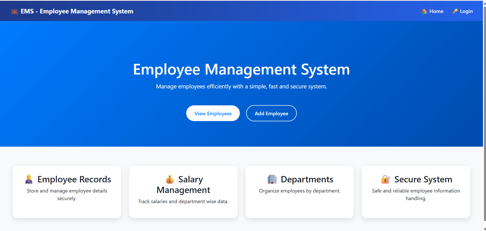
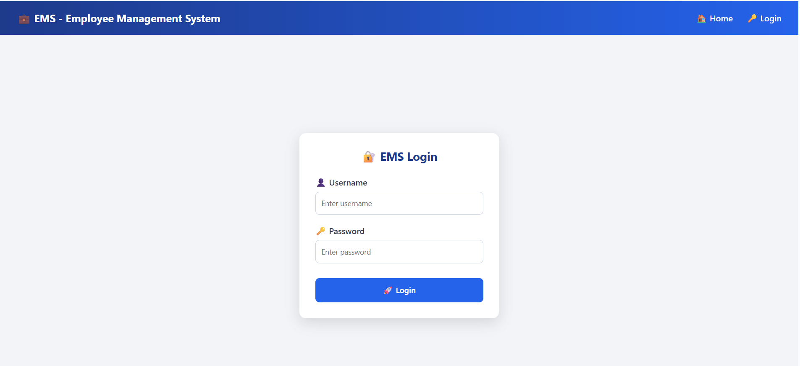
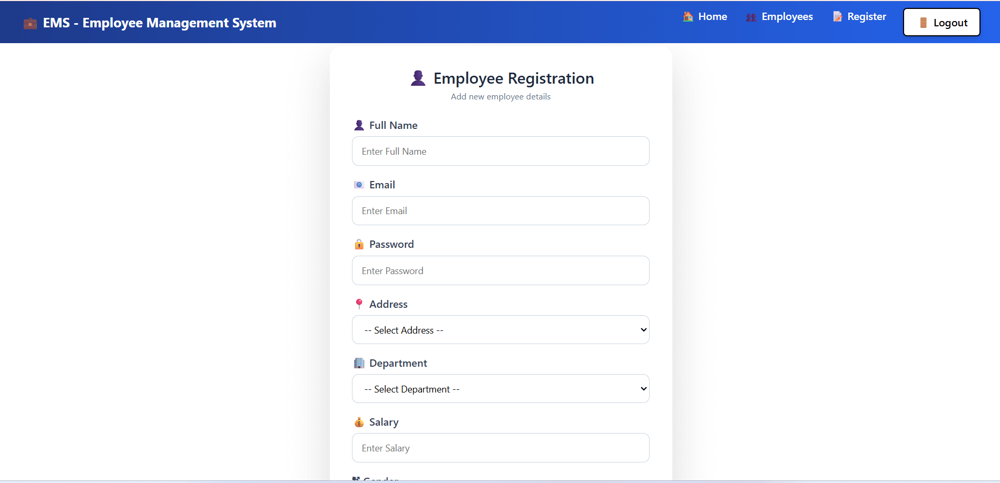
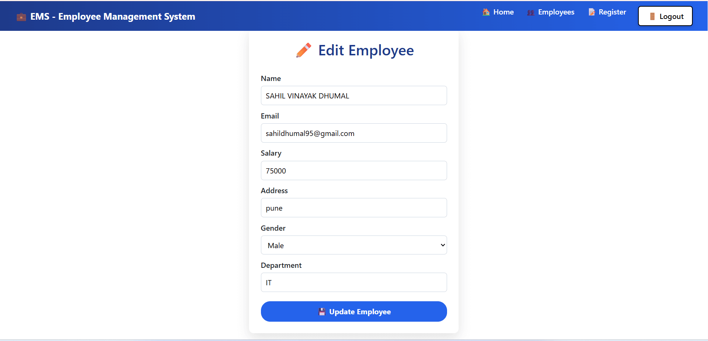
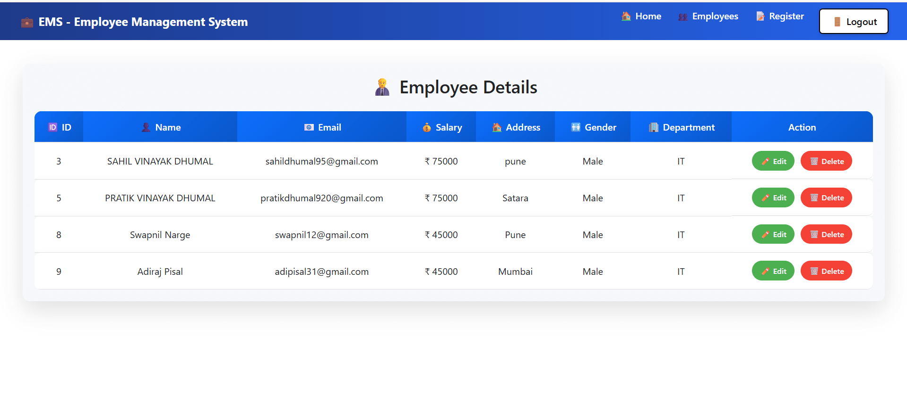

# 🧑‍💼 Employee Management System  
(Spring Boot + Angular)

🚀 A Full Stack Employee Management System developed using  
**Spring Boot (Backend)** and **Angular (Frontend)** with **Spring Security**.

---

## 🔐 Login & Security Flow

### 🔓 Without Login
The navigation bar displays:
- 🏠 Home
- 🔑 Login

### 🔒 After Login
The navigation bar displays:
- 🏠 Home
- 👨‍💼 Employees
- 📝 Register Employee
- ✏️ Update Employee
- 🚪 Logout

### 🚪 Logout
- User session is cleared after logout  
- User must log in again to access secured pages

---

## 🔑 Demo Login Credentials

👤 **Username** : pratik  
🔒 **Password** : 1212  

⚠️ *(For demo and testing purposes only)*

---

## ✨ Features
- 🔐 Secure Login and Logout using Spring Security
- 📋 View employee list
- ➕ Register new employee
- ✏️ Update employee details
- 🚫 Unauthorized access is restricted

---

## 🧰 Tech Stack

### 🎨 Frontend
- Angular
- TypeScript
- HTML
- CSS

### ⚙️ Backend
- Spring Boot
- Spring Security
- Java
- REST API

### 🗄️ Database
- MySQL

---

## 📸 Screenshots

🏠 **Home Page**  

🔑 **Login Page**  

📝 **Register Employee**  

✏️ **Update Employee**  

👨‍💼 **Employee Details**  

---

## ▶️ How to Run the Project

### ⚙️ Backend
- Run the Spring Boot application  
- Backend URL:  
http://localhost:8080
